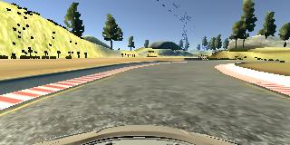
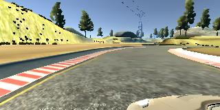
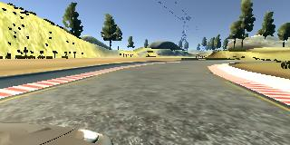
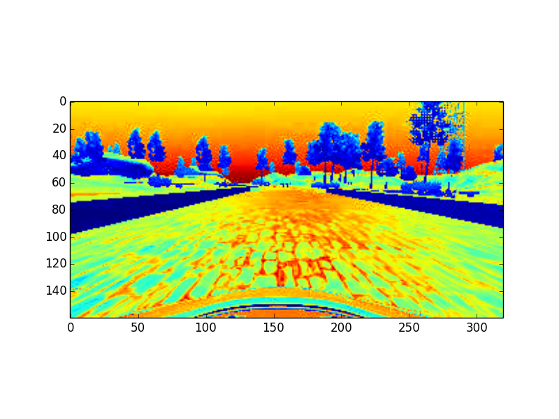

## Behavioral Cloning Project

The goals / steps of this project are the following:
* Use the simulator to collect data of good driving behavior
* Build, a convolution neural network in Keras that predicts steering angles from images
* Train and validate the model with a training and validation set
* Test that the model successfully drives around track one without leaving the road
* Summarize the results with a written report

## Rubric Points
Here I will consider the [rubric points](https://review.udacity.com/#!/rubrics/432/view) individually and describe how I addressed each point in my implementation.  

---
### Files Submitted & Code Quality

#### 1. Submission includes all required files and can be used to run the simulator in autonomous mode

My project includes the following files:

* model.py containing the script to create and train the model
* drive.py for driving the car in autonomous mode
* model_nvidia.h5 containing a trained convolution neural network 
* writeup_report.md summarizing the results

#### 2. Submission includes functional code
Using the Udacity provided simulator and my drive.py file, the car can be driven autonomously around the track by executing 

```sh
python drive.py model.h5
```

#### 3. Submission code is usable and readable

The model.py file contains the code for training and saving the convolution neural network. The file shows the pipeline I used for training and validating the model, and it contains comments to explain how the code works.

### Model Architecture and Training Strategy

#### 1. An appropriate model architecture has been employed

My model consists of several convolution neural network in conjunction with several layers of fully connected layers. The RELU and pooling layers are used to introduce nonlinearity, and the images are set to grayscale, and are normalized in the model using a Keras Lambda layer. [`model.py`](./model.py) `line 14`

#### 2. Attempts to reduce overfitting in the model

The model contains two dropout layers in order to reduce overfitting. 

The model was trained and validated on different data sets to ensure that the model was not overfitting. The model was tested by running it through the simulator and ensuring that the vehicle could stay on the track.

#### 3. Model parameter tuning

The model used an adam optimizer, so the learning rate was not tuned manually.

#### 4. Appropriate training data

Training data was chosen to keep the vehicle driving on the road. I used a combination of different tracks and reverted direction on one track to increase generality. 

### Model Architecture and Training Strategy

Several strategies were used to derive the model architecture. 

#### Primary Design

First I tried to feed the data into a Keras model with an architecture designed by the Nvidia team [paper](http://images.nvidia.com/content/tegra/automotive/images/2016/solutions/pdf/end-to-end-dl-using-px.pdf). In this architecture, 5 convelutional layers are followed by four fully connected layers. It results in 2,697,031 parameters. 

```sh
_________________________________________________________________
Layer (type)                 Output Shape              Param #   
=================================================================
cropping2d_1 (Cropping2D)    (None, 80, 320, 3)        0         
_________________________________________________________________
batch_normalization_1 (Batch (None, 80, 320, 3)        12        
_________________________________________________________________
conv2d_1 (Conv2D)            (None, 80, 320, 24)       1824      
_________________________________________________________________
max_pooling2d_1 (MaxPooling2 (None, 40, 160, 24)       0         
_________________________________________________________________
conv2d_2 (Conv2D)            (None, 40, 160, 36)       21636     
_________________________________________________________________
max_pooling2d_2 (MaxPooling2 (None, 20, 80, 36)        0         
_________________________________________________________________
conv2d_3 (Conv2D)            (None, 20, 80, 48)        43248     
_________________________________________________________________
max_pooling2d_3 (MaxPooling2 (None, 10, 40, 48)        0         
_________________________________________________________________
conv2d_4 (Conv2D)            (None, 10, 40, 64)        27712     
_________________________________________________________________
conv2d_5 (Conv2D)            (None, 10, 40, 64)        36928     
_________________________________________________________________
flatten_1 (Flatten)          (None, 25600)             0         
_________________________________________________________________
dense_1 (Dense)              (None, 100)               2560100   
_________________________________________________________________
dense_2 (Dense)              (None, 50)                5050      
_________________________________________________________________
dense_3 (Dense)              (None, 10)                510       
_________________________________________________________________
dense_4 (Dense)              (None, 1)                 11        
=================================================================
Total params: 2,697,031
Trainable params: 2,697,025
Non-trainable params: 6
```

After training on 5625 samples for 5 epochs, the vehicle can make the correct steering in case of curves on the track, though still fails out of the track in case of large curve and illusive landmarks. Then I decide to trim the unnecessary part of the model, and increase the complexity of the model for generalization. 

#### Improvement in generality
Several driving senario were collected, including driving in different tracks and driving in inverted directions to increase the generality of the training data. 

#### Improvement in preprocessing
As we've observed, the three cameras on the front of the vehicle, including the center, left and right cameras, all records the track information. Therefore, we keep only the center camera for data feedign. 





Second, we've found that part of the images are not relevant to the road information, like the sky on top and the car hood on bottom of the image. Therefore, I used a cropping layer on the neural network. 

Also, as we've found, the RGB and grayscale images both yields the luminence, edge and shape information of the scene critical for driving feedback. We would like to introduce a Lambda layer in the model to convert the GVB images into one-channel grayscale image to reduce the number of model parameters. The image is also normalized in the Lambda layer. 


#### Improvement in robustness 
Two dropoff layers were introduced in the model. One is right after the fourth convolutional layer, the second is right before the fully connected layers. The drop off rates were set to 0.5 to increase the robustness of the model. 

#### Final model architecture 

```sh
_________________________________________________________________
Layer (type)                 Output Shape              Param #   
=================================================================
cropping2d_1 (Cropping2D)    (None, 110, 320, 3)       0         
_________________________________________________________________
lambda_1 (Lambda)            (None, 110, 320, 1)       0         
_________________________________________________________________
conv2d_1 (Conv2D)            (None, 106, 316, 8)       208       
_________________________________________________________________
max_pooling2d_1 (MaxPooling2 (None, 53, 158, 8)        0         
_________________________________________________________________
conv2d_2 (Conv2D)            (None, 49, 154, 16)       3216      
_________________________________________________________________
max_pooling2d_2 (MaxPooling2 (None, 24, 77, 16)        0         
_________________________________________________________________
conv2d_3 (Conv2D)            (None, 20, 73, 24)        9624      
_________________________________________________________________
max_pooling2d_3 (MaxPooling2 (None, 10, 36, 24)        0         
_________________________________________________________________
conv2d_4 (Conv2D)            (None, 6, 32, 32)         19232     
_________________________________________________________________
max_pooling2d_4 (MaxPooling2 (None, 3, 16, 32)         0         
_________________________________________________________________
dropout_1 (Dropout)          (None, 3, 16, 32)         0         
_________________________________________________________________
conv2d_5 (Conv2D)            (None, 3, 16, 40)         11560     
_________________________________________________________________
conv2d_6 (Conv2D)            (None, 3, 16, 40)         14440     
_________________________________________________________________
flatten_1 (Flatten)          (None, 1920)              0         
_________________________________________________________________
dense_1 (Dense)              (None, 80)                153680    
_________________________________________________________________
dropout_2 (Dropout)          (None, 80)                0         
_________________________________________________________________
dense_2 (Dense)              (None, 40)                3240      
_________________________________________________________________
dense_3 (Dense)              (None, 20)                820       
_________________________________________________________________
dense_4 (Dense)              (None, 10)                210       
_________________________________________________________________
dense_5 (Dense)              (None, 1)                 11        
=================================================================
Total params: 216,241
Trainable params: 216,241
Non-trainable params: 0
```

#### Training set up
I finally randomly shuffled the 13884 data samples and put 10% of the data into a validation set. 

I used an adam optimizer so that manually training the learning rate wasn't necessary.

Mean squared error is used for measuring the performance of the regression. 

The batch size was set to 100, the number of epochs was set to 10. 

It took one hour of the training, which yields the following records

```sh
Train on 12495 samples, validate on 1389 samples
Epoch 1/1
12495/12495 [==============================] - 434s 35ms/step - loss: 0.0199 - val_loss: 0.0338
Train on 12495 samples, validate on 1389 samples
Epoch 1/1
12495/12495 [==============================] - 348s 28ms/step - loss: 0.0157 - val_loss: 0.0322
Train on 12495 samples, validate on 1389 samples
Epoch 1/1
12495/12495 [==============================] - 350s 28ms/step - loss: 0.0151 - val_loss: 0.0307
Train on 12495 samples, validate on 1389 samples
Epoch 1/1
12495/12495 [==============================] - 356s 28ms/step - loss: 0.0147 - val_loss: 0.0309
Train on 12495 samples, validate on 1389 samples
Epoch 1/1
12495/12495 [==============================] - 351s 28ms/step - loss: 0.0146 - val_loss: 0.0298
Train on 12495 samples, validate on 1389 samples
Epoch 1/1
12495/12495 [==============================] - 352s 28ms/step - loss: 0.0143 - val_loss: 0.0298
Train on 12495 samples, validate on 1389 samples
Epoch 1/1
12495/12495 [==============================] - 359s 29ms/step - loss: 0.0139 - val_loss: 0.0300
Train on 12495 samples, validate on 1389 samples
Epoch 1/1
12495/12495 [==============================] - 353s 28ms/step - loss: 0.0139 - val_loss: 0.0300
Train on 12495 samples, validate on 1389 samples
Epoch 1/1
12495/12495 [==============================] - 344s 28ms/step - loss: 0.0136 - val_loss: 0.0283
Train on 12495 samples, validate on 1389 samples
Epoch 1/1
12495/12495 [==============================] - 351s 28ms/step - loss: 0.0134 - val_loss: 0.0284
```

Please see the [video record of one round of driving](./output_video.mp4). In the autonomous mode, the vehicle was able to keep driving at the center of the track. The steering performances well in sharp turnings. 

